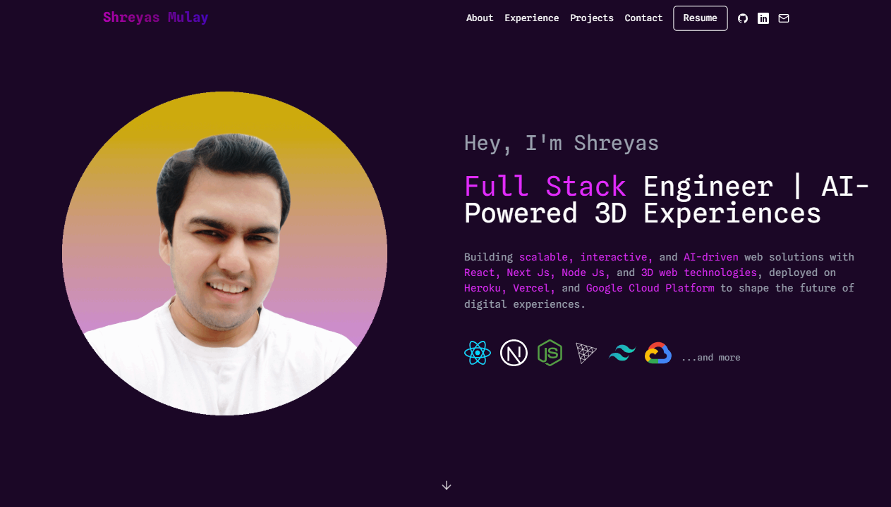

# 🚀 Shreyas Mulay – Portfolio




[](https://github.com/shreyasmulay23/my-portfolio/stargazers)
[](https://github.com/shreyasmulay23/my-portfolio/network)
[](https://github.com/shreyasmulay23/my-portfolio)
[](https://github.com/shreyasmulay23/my-portfolio/commits/main)
[](https://img.shields.io/website?url=http%3A//shreyas-mulay.vercel.app/)

---

### 🧑‍💻 Live Portfolio

🌐 [shreyas-mulay.vercel.app](https://shreyas-mulay.vercel.app/)  
📱 **Fully Responsive – Mobile, Tablet, and Desktop support**

---

## 📌 About the Project

A sleek and professional **Full Stack JavaScript Developer Portfolio** built to stand out in front of recruiters and showcase my work and skills.

Built with:

- ⚛️ **Next.js** with App Router
- 🎨 **Tailwind CSS v3** (Glassmorphism + Neumorphism)
- 🎬 **Framer Motion** for smooth, modern animations
- 🌐 **Mobile-first** responsive layout
- 🌑 **Dark/Light mode toggle**
- 🧠 Optional 3D visuals (React Three Fiber) – temporarily removed for performance

---

## 🖼️ Sections

- **Hero**: Punchy intro, resume button, social icons
- **About Me**: Skills, fun facts, short bio
- **Projects**: Live previews (AI, 3D, Performance, etc.)
- **Experience**: Timeline with hoverable job roles
- **Contact**: Let's Connect form + social handles

---

## 🧰 Tech Stack

| Category    | Tech Stack                             |
|-------------|----------------------------------------|
| ⚛️ Frontend | React.js, Next.js 14 (App Router)      |
| 🎨 Styling   | Tailwind CSS v3, Glassmorphism, Neumorphism |
| 🎬 Animations| Framer Motion, GSAP                    |
| 📱 Responsive | Mobile-First Design                   |
| 🚀 Hosting   | Vercel                                 |

---

## ⚙️ Installation

```bash
git clone https://github.com/shreyasmulay23/my-portfolio.git
cd my-portfolio
npm install
npm run dev
